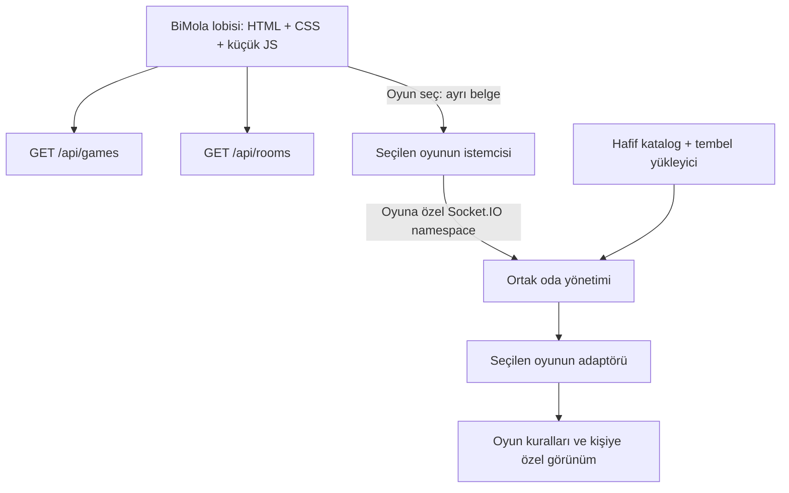

# BiMola mimarisi

## Amaç ve temel karar

BiMola bir oyun motoru değil, farklı oyunları buluşturan bir platformdur. Ortak katman oyunları listeler, odaları bulur ve bağlantı/oda yaşam döngüsünü yönetir. Oyunun takım, skor, sıra, harita, fizik, kazanma ve gizlilik kuralları kendi modülünde kalır.

Şimdilik tek Node.js süreci ve mevcut Express + Socket.IO bağımlılıkları yeterli. Yeni framework, paket veya monorepo aracı eklenmedi. Ayrı servislerin operasyon maliyeti yerine, gerektiğinde ayrılabilecek net modül sınırları kuruldu.



## İstemci sınırları

`/` yalnızca `public/platform` kodunu çalıştırır. Katalogdan gelen bir kapak görseli oyunun çalıştırılması değildir. Lobi Three.js, oyun haritaları, karakter modelleri, WebSocket veya oyun simülasyonu yüklemez.

Her oyun `/games/<id>/` altında bağımsız bir HTML girişine sahiptir. 2D bir kelime oyunu Three.js kullanmak zorunda değildir. Saklanma oyununun kodu `public/games/prop-hunt/` altında, sunucu kuralları `server/games/prop-hunt/` altındadır. Hem sunucuda hem tarayıcıda gereken oyun fiziği gibi saf yardımcılar ilgili oyunun istemci dizininde durur; sır barındırmaz ve DOM/Node bağımlılığı taşımaz. Sunucuya özel kurallar statik dosya sunucusuna açılmaz.

**Oyunlar arasında tam sayfa geçişi bilinçli bir tercih.** Böylece her yeni oyunun yüzlerce WebGL geometrisini, zamanlayıcısını ve olay dinleyicisini SPA içinde hatasız kaldırmasını gerektirmiyoruz. Önceki belge bırakılır, yalnızca yeni oyun çalışır. Ufak sayfa geçiş maliyeti kaynakların birlikte birikmemesi için kabul edildi. Ortak oyuncu adı tek yardımcı üzerinden, eski `mola-name` tercihini okuyarak korunur.

Nesne Avı `pagehide` sırasında çizim döngüsünü, zamanlayıcıları, soketi, ses bağlamını ve WebGL bağlamını kapatır. Geri/ileri önbelleğinden dönerse yeni bir oturumla yeniden yüklenir. Gizlenen sekme hareket paketi göndermez ve çizim döngüsünü durdurur; sunucudaki tur devam eder. Bağlantı koparsa eski oyuncu kimliğiyle sessizce devam etmez; tekrar katılma gerekir.

## Oyun kaydı

`server/games/registry.js` içinde her kayıt iki parçalıdır:

```js
{
  manifest: {
    id: 'my-game',
    name: 'Oyunun adı',
    description: 'Oyuncunun ne yapacağını anlatan kısa metin.',
    category: 'Kelime',
    minPlayers: 2,
    maxPlayers: 8,
    duration: '5 dk',
    bots: false,
    input: 'Dokunmatik / klavye',
    status: 'available',
    entry: '/games/my-game/',
    cover: '/games/my-game/cover.webp',
    namespace: '/games/my-game',
    protocolVersion: 1,
  },
  load: () => import('./my-game/adapter.js').then(module => module.adapter),
}
```

Tanımın kendisi oyun motorunu import etmez. `/api/games` yalnızca manifestleri döndürür; yükleme fonksiyonları sunucuda kalır. Adaptör ilk bağlantıda yüklenir. Aynı anda gelen ilk bağlantılar aynı yükleme sözünü paylaşır; yükleme hatası tekrar denenebilir. Kayıt sırasında çakışan kimlikler ve yanlış adresler, yükleme sırasında eksik adaptör metotları reddedilir.

`status: 'available'` olan oyunlara girilir. Diğer durumlar lobide “Yakında” görünür ve bağlantı alanları açılmaz. Gerçekte eklenmemiş oyunlar katalogda gösterilmez.

## Sunucu adaptörü sözleşmesi

Metotlar **senkron** olmalıdır; `load` dışında Promise dönmez. Adaptörlerin WebSocket'e ve bütün odalara doğrudan erişimi yoktur. Ortak zamanlayıcıdan başka per-room `setInterval` açılmaz. Veri tabanı/uzak servis çağrısı simülasyon döngüsünün içine konulmaz.

| Alan / metot | Sorumluluk |
|---|---|
| `create({code, host, data})` | Henüz üyesi olmayan oyun oda durumunu oluşturur. Platform `code` ve `gameId` alanlarını sabitler. |
| `canJoin(room, data)` | Kapasite, özel/antrenman oda veya faz kuralını kontrol eder; `{ok:true}` ya da `{error}` döndürür. |
| `addPlayer(room, {id, name, data})` | Doğrulanmış oyuncuyu ekler; takım veya sırayı oyun seçer. İsteğe bağlı katılma yanıtı döndürür. |
| `removePlayer(room, id)` | Oyuncuyu, sahip olduğu oyun nesnelerini ve gerekirse oda sahibi yetkisini devreder/temizler. |
| `members(room)` | İnsan bağlantıları: en az `{id}` içeren dizi; botlar dahil edilmez. |
| `summary(room)` | Gizli veri içermeyen `{players, capacity, phase, joinable, ...}` oda özeti. `joinable:false` odaları platform listelemez. |
| `view(room, playerId, now)` | **O oyuncunun görmeye yetkili olduğu** JSON durumunu üretir. Platform `gameId` ve `protocolVersion` ekler. |
| `tickInterval(room)` | Milisaniye; `0` odanın zamanlayıcı istemediğini belirtir. Pozitif aralık en az 10 ms. |
| `snapshotInterval` | Düzenli durum yayın aralığı; en az 25 ms. Oyunların aynı hızda olması gerekmez. |
| `tick(room, now, dt)` | Simülasyonu ilerletir. `now`: epoch ms, `dt`: en fazla 0.1 saniye. İsteğe bağlı `{changed, events:[{playerId,event,data}]}` döndürür; yalnız aynı odadaki kişiye gönderilir. `changed:true`, faz/sonuç gibi kritik değişimde hemen güvenilir durum yayını ister. |
| `commands` | İzinli oyun komutları. Her birinde `{interval, handle, publish?, event?}`. |

`command.handle(room, playerId, payload, now)` girdiyi doğrular ve `{ok:true}` veya `{error}` döndürür. `interval` aynı soketten komut kabulü arasındaki minimum ms'dir. `publish:true`, başarılı komuttan sonra güvenilir durum yayını ve zamanlayıcı değerlendirmesi yapar; faz/takvim değiştiren komutlarda kullanılmalıdır. Sıra tabanlı oyunda `tickInterval: () => 0` ve `publish:true` komutlar yeterlidir. `event` yalnız komutu gönderen kişiye ek sonuç olayı yollar. Özel olaylarda ack son argümandır; hem `emit('start', ack)` hem `emit('action', payload, ack)` desteklenir.

Ortak `join`, `leave`, `state` ve Socket.IO bağlantı olayları adaptör tarafından yeniden tanımlanamaz. Fazlar adaptöre aittir; lobi bilmediği fazı metin olarak gösterebilir. Komut hata ve izin kontrolleri oyunun sorumluluğundadır; saklanma adaptörü mevcut kurucu/takım/oylama kurallarını kullanır.

### Bağlantı ve odalar

```js
const socket = io('/games/my-game');
socket.timeout(6000).emit('join', {name: 'Ada'}, (error, result) => { /* UI */ });
// Var olan odaya: {name: 'Ada', code: '1234'}
socket.on('state', state => { /* state.gameId ve protocolVersion kontrolü */ });
socket.on('room-error', result => { /* oyun ekranından güvenli çıkış */ });
```

Kodlar platformda tek havuzdan üretilir, oyunlar arasında çakışmaz. Oda oyun kimliği sunucuda belirlenir; istemci başka oyunun kodunu kendi namespace'inden kullanamaz. Soketin oda üyeliği yalnız sunucuda tutulur. Olmayan/dolu/yanlış oyundaki oda reddedildiğinde mevcut üyelik korunur. Son insan ayrıldığında oda ve zamanlayıcı kaydı silinir.

`/api/rooms/:code`, katılınabilir oda için oyunun doğru giriş adresini verir. Eski `/?room=1234` linkleri bunu kullanır; yeni saklanma davetleri doğrudan `/games/prop-hunt/?room=1234` adresini taşır. Odanın kontrol ile katılma arasında dolması mümkündür; son kararı her zaman `canJoin` verir.

## Kaynak ve ağ bütçeleri

| Katman | Uygulanan davranış |
|---|---|
| Lobi kaynakları | HTML + CSS + JS ≤ 40 KiB sıkıştırılmamış; testte ölçülür. Görseller bu bütçenin dışında, tembel yüklenir. Harici font yok. |
| Lobi ağ trafiği | Katalog başlangıçta bir kez; odalar görünürken 15 saniyede bir, üst üste istek yok. Gizlenirken istek iptal edilir. |
| Boş oyun lobisi | Sıfır simülasyon, sıfır periyodik durum yayını; katılma/ayrılma/ayar gibi değişimler yayınlanır. |
| Nesne Avı turu | 25 ms simülasyon / 50 ms düzenli durum yayını. Mevcut kişiye özel gizlilik filtreleri korunur. |
| Tur sonrası oylama | Açıkken 250 ms kontrol; kapanış durumu güvenilir yayınlanır ve döngü durur. |
| Gecikmiş simülasyon | `dt` en fazla 0.1 sn; eksik adımları biriktirip sunucuyu daha fazla yoran telafi döngüsü yok. Bu yaklaşım sabit adımlı deterministik replay sağlamaz. |
| Yavaş bağlantı | Düzenli paketler `volatile`; soket hazır değilse pahalı görünüm üretimi atlanır. Hareket girdileri de biriktirilmez. |
| Kontrol paketleri | Katılma, ayarlar ve komut sonuçları normal güvenilir iletim kullanır; tekrar bağlanmada kalıcı teslim garantisi yoktur. |
| İstemci yükü | Girdi boyutu 4 KiB; komut başına frekans sınırı. Bu sınırlar DDoS koruması veya kullanıcı kotası değildir. |
| Oda bütçesi | Varsayılan 64, `MAX_ROOMS` ile 1–9000 arası yapılandırılır. 64 odanın her donanımda akıcı çalışacağı iddia edilmez. |

`createGameServer().metrics` içeride `ticks`, `snapshots`, `skippedSnapshots`, `failedRooms` sayaçlarını sağlar. Bunlar test ve gözlem noktalarıdır; dışarı açık yönetim API'si değildir. Zayıf cihazlarda saklanma oyununun mevcut otomatik kalite düşürmesi aynen çalışır.

Yeni oyun eklemek lobinin JS paketine oyun motoru katmaz. Sunucuda yüklenmiş modüller Node modül önbelleğinde kalır; odası kapanmış motor kodu otomatik unload edilmez. Ağır veya çok sayıda motor için süreç ayrımı kullanılmalıdır.

## Büyüme yolu ve dürüst sınırlar

Bu sürüm **tek süreçte modüler** çalışır. Oda bazlı `try/catch` ile normal oyun istisnası ilgili odayı kapatır, diğer odalar devam eder. Bu, CPU veya bellek izolasyonu değildir: sonsuz döngü, çok uzun bir tick veya süreç çökmesi bütün oyunları etkiler.

1. Önce hedef cihazlarda FPS/kare süresi ve hedef sunucuda eşzamanlı oda, tick gecikmesi, CPU/RSS ve kişi başına ağ trafiğini ölç. Özellikle botlu büyük haritaları ayrıca yükle.
2. Snapshot boyutu baskınsa ilgili oyuna sabit harita verisi + değişen nesneler için delta protokolü ekle. Şimdiki saklanma oyunu kişiye özel tam durum yollar; uydurma bir bant genişliği kazanımı iddiası yoktur.
3. CPU sınırında, bu adaptör sınırını oda işçilerine/ayrı oyun süreçlerine taşı. Sunucu otoritesi ve gizlilik işçi tarafında kalmalı; ortak katman yönlendirme yapmalı.
4. Çok sunucuda oda → süreç dizini ve doğru sürece yönlendirme gerekir. Socket.IO Redis adaptörü tek başına bellekteki oyun simülasyonunu paylaşmaz. 4 haneli kod havuzu ve oda bulma bu aşamada merkezi hale getirilmelidir.
5. Hesap/ilerleme/maç geçmişi gerekiyorsa kalıcı veriyi ayrı servis/depo katmanına ekle. Otomatik yeniden katılım için `socket.id` yerine doğrulanmış oturum kimliği, ayrılma toleransı ve oda geri yükleme tasarlanmalıdır.

Şimdiden bütün oyunlara fizik motoru, durum deposu veya React zorunlu kılınmadı. Her oyun kendi ihtiyaçlarına göre DOM, Canvas 2D veya WebGL kullanabilir.

## Yeni oyun ekleme kontrolü

1. `public/games/<id>/index.html` ve oyun istemcisini oluştur; varlıkları o klasörde tut. Oyundan BiMola'ya `/` bağlantısını ekle.
2. `server/games/<id>/adapter.js` oluştur; yukarıdaki sözleşmeyi uygula. Örnek: `prop-hunt/adapter.js`. Takımsız/sıra tabanlı minimal örnek: `test/platform.test.js` içindeki `counterGame`.
3. `server/games/registry.js` içine manifest + `load` kaydı ekle. Lobi kendisi listeler; `/api/rooms` yeni oyunu da toplar.
4. Yetkisiz komut, gizli bilgi, katılma/ayrılma, doluluk, son oyuncuda temizlenme, iki eşzamanlı oda ve farklı oyunla izolasyon testlerini ekle. Başka oyun motorunu import etme.
5. Tarayıcıda gir → oyna → lobiye dön → başka oyuna gir akışını kontrol et. Gizlenen sekme ve geri/ileri önbelleği için yaşam döngüsünü tanımla; çizim, soket ve sesi temizle.
6. `npm test` çalıştır; kaynak bütçesini ve hedef cihaz performansını doğrula.

## Doğrulama

Eski oynanış testleri yeni klasörlere taşınan modülleri kullanır. Ağ testleri oyuna ait namespace üzerinden gerçek Socket.IO istemcileriyle çalışır. Yeni platform testleri ikinci bağımsız oyunu **yalnız test içinde** kaydeder: tembel yükleme, çoklu oyun kataloğu, oda kodu ve veri izolasyonu, sıfır boşta yayın, oda sınırı, oda kapanışı, oyun hatası yalıtımı, yayın frekansı ve oylama zamanlayıcısı doğrulanır.

Bu testler onlarca gerçek cihazla internet yük testi veya Docker doğrulaması yerine geçmez.
